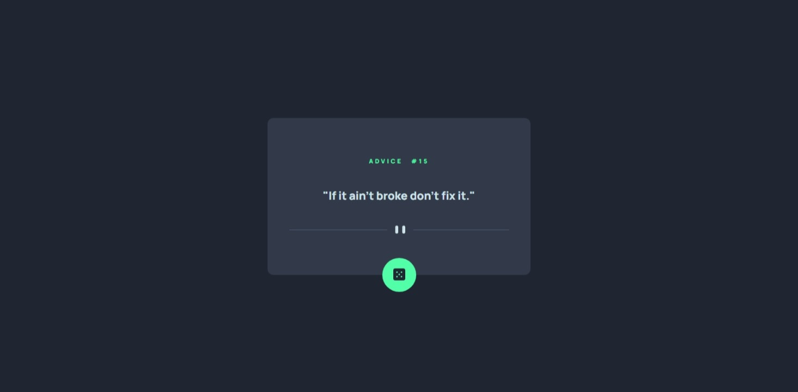

# advice-generator-app-main
# Frontend Mentor - Advice generator app solution

This is a solution to the [Advice generator app challenge on Frontend Mentor](https://www.frontendmentor.io/challenges/advice-generator-app-QdUG-13db). Frontend Mentor challenges help you improve your coding skills by building realistic projects.

## Table of contents

- [Overview](#overview)
  - [The challenge](#the-challenge)
  - [Screenshot](#screenshot)
  - [Links](#links)
  - [Built with](#built-with)
  - [What I learned](#what-i-learned)
  - [Continued development](#continued-development)
  - [Useful resources](#useful-resources)
- [Author](#author)


## Overview

### The challenge

Users should be able to:

- View the optimal layout for the app depending on their device's screen size
- See hover states for all interactive elements on the page
- Generate a new piece of advice by clicking the dice icon

### Screenshot



### Links

- Solution URL: [https://github.com/mk513147/advice-generator-app-main.git]
- Live Site URL: [https://advo-gen.netlify.app/]


### Built with

- Semantic HTML5 markup
- CSS custom properties
- Flexbox
- CSS Grid
- API

### What I learned

I learned how to use async function with API in this challenge.

```js
async function getAdvice() {
    console.log("✨")
  }
```

### Continued development

I want to learn more abut API's and how to use it on a website.

### Useful resources

- [https://loading.io/] - This website helped me to set loading screen reason. I really liked this website and will use it going forward.
- [https://fonts.google.com/] - This is an amazing website which helped me in applaying amazing fonts to my website.


## Author

- Website - [Mohit Kumar](https://www.your-site.com)
- Frontend Mentor - [@mk513147](https://www.frontendmentor.io/profile/mk513147)

